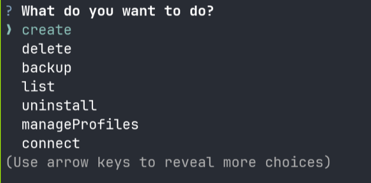

# SSHIP


**SSHIP** simplifies your SSH key management directly from your command line. Easily create, delete, list, and back up your SSH keys, and streamline your SSH connections.

## Features

SSHIP provides a comprehensive set of tools for efficient SSH key management:

*   **Create Keys (`sship create`):** Generate new SSH key pairs with options for email, passphrase, key name, host, and user. Automatically updates your `~/.ssh/config`.
*   **Delete Keys (`sship delete`):** Interactively select and remove SSH key pairs, including associated public keys and `~/.ssh/config` entries.
*   **List Keys (`sship list`):** View all detected SSH key pairs in your `~/.ssh/` directory.
*   **Backup Keys (`sship backup`):** Securely back up your SSH keys and configuration files. Supports optional GPG encryption.
*   **Connect (`sship connect`):** Quickly connect to SSH aliases defined in your `~/.ssh/config`.
*   **Doctor (`sship doctor`):** Diagnose and fix issues in your `~/.ssh/config` by identifying and offering to remove entries referencing non-existent keys.
*   **Onboard (`sship onboard`):** Set up unaliased private SSH keys by adding them to your `~/.ssh/config` and associating them with SSHIP profiles.
*   **Manage Profiles (`sship profile`):** Organize your SSH keys into profiles for easier management and access. Create, remove, rename, and list profiles.



## Installation

### Prerequisites

Ensure you have the following installed:

*   **Node.js** (for npm installation)
*   **Bun** (for manual installation or development)
*   **jq**: A command-line JSON processor.
*   **gpg**: GNU Privacy Guard (for optional backup encryption).

### Via npm (Recommended)

Install SSHIP globally using npm:

```bash
npm install -g sship
```

This command installs two executables:
*   `sship`: The main command-line interface for direct command execution.
*   `sship-main`: Launches the interactive menu-driven interface.

### Via Script (Unix/Linux)

For Unix-like systems, you can use the quick installation script:

```bash
curl -fsSL https://raw.githubusercontent.com/Makumiii/sship/main/scripts/bash/install.sh | sh
```

### Manual Installation

If you prefer a manual setup:

```bash
git clone https://github.com/Makumiii/sship.git
cd sship
bun install
```

## Usage

SSHIP offers both a direct command-line interface and an interactive menu.

### CLI Mode

Execute specific commands directly:

```bash
# Create a new SSH key
sship create -n my_new_key -e my@example.com -p mypassphrase -h github.com -u git

# Delete an SSH key
sship delete my_old_key

# List all SSH keys
sship list

# Run the doctor to check your SSH config
sship doctor

# Get help for a specific command
sship create --help
```

### Interactive Mode

For a guided experience, run the interactive menu:

```bash
sship-main
```

Follow the on-screen prompts to choose your desired SSH key management task.

## Development

To contribute to SSHIP or run it from source:

1.  **Clone the repository:**
    ```bash
    git clone https://github.com/Makumiii/sship.git
    cd sship
    ```
2.  **Install dependencies:**
    ```bash
    bun install
    ```
3.  **Build the project:**
    ```bash
    bun run build
    ```
4.  **Run in development mode:**
    ```bash
    bun run dist/main.js
    # Or for CLI commands:
    bun run dist/cli.js [command] [options]
    ```

## Contributing

Contributions are welcome! Please open an issue or pull request on the [GitHub repository](https://github.com/Makumiii/sship).

## License

This project is licensed under the MIT License. See the [LICENSE](LICENSE) file for details.
