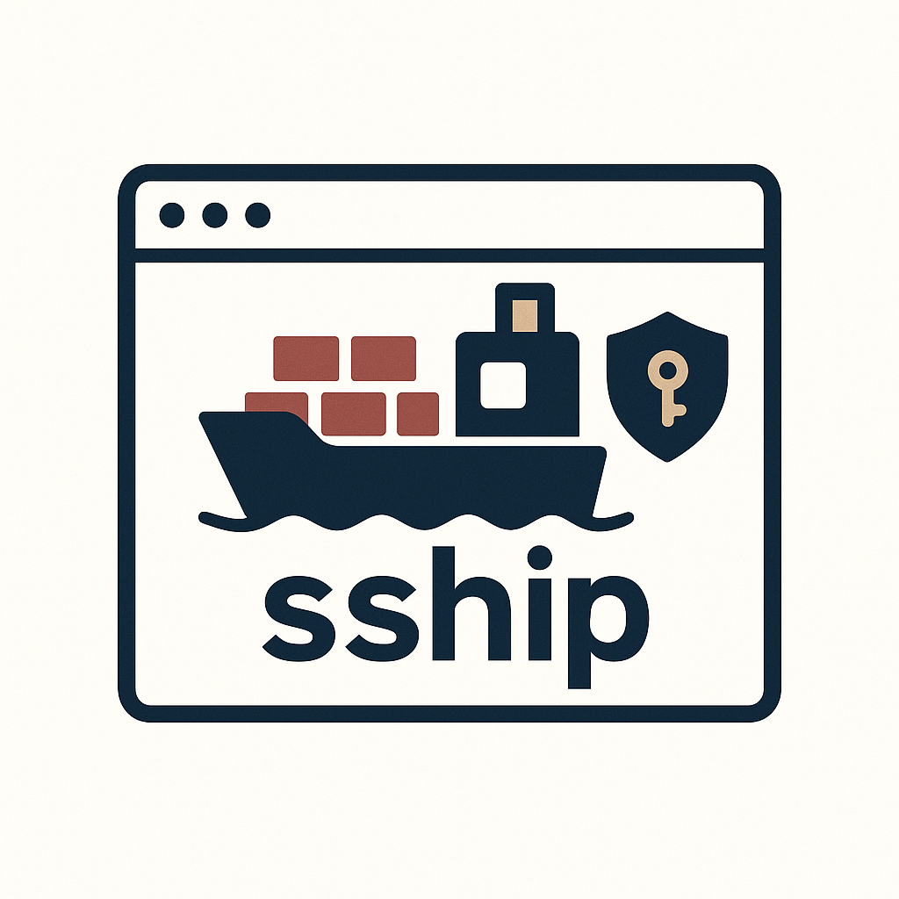

# SSHIP

<p align="center">
  
</p>

<p align="center">
  
</p>

**SSHIP** is an interactive SSH workflow app.
It helps you manage keys, servers, tunnels, backup/restore, and transfer flows without memorizing long command syntax.

## What This App Does

SSHIP gives you one guided interface for day-to-day SSH operations.

- Create and manage service keys for platforms like GitHub/GitLab/Bitbucket
- Manage PEM server profiles and connect/test them quickly
- Discover and run SSH tunnels with saved configs
- Backup and restore your SSH files safely
- Launch Synergy transfer for browser-based file movement
- Run environment checks and diagnostics (`init`, `doctor`, logs)

## Install

### npm (Recommended)

```bash
npm install -g sship
```

### Linux/macOS Install Script

```bash
curl -fsSL https://raw.githubusercontent.com/Makumiii/sship/main/scripts/bash/install.sh | sh
```

### Development

```bash
git clone https://github.com/Makumiii/sship.git
cd sship
bun install
bun run build
```

## Quick Start

Start the interactive CLI:

```bash
sship
```

Use the menu to access Service Keys, Servers, Tunnels, Backup/Restore, Onboard, Doctor, Logs, and Transfer.

## Main Features

### Interactive CLI First

- Guided prompts and validations
- Clear action menus for each workflow
- Lower cognitive load than raw command memorization

### Service Keys

- Template-based creation for common SSH-enabled services
- Track and manage only keys created/onboarded in SSHIP
- Public-key display and key lifecycle actions in one place

### Server Connections (PEM)

- Save server profiles with host/user/key metadata
- Test connectivity before use
- Connect via named server profiles

### Tunnel Manager

- Discover remote listening ports
- Save/start/stop tunnel definitions
- Reuse tunnel configs without retyping options

### Backup and Restore

- Backup SSH assets
- Dry-run restore validation
- Selective restore support

### Transfer (Synergy)

- Browser-based transfer interface
- SSH-config/PEM based connections
- File operations with real-time feedback

### Health and Setup Tools

- `sship init` / `sship init --fix`
- `sship doctor` / `sship doctor --fix-all`
- `sship logs` filtering for troubleshooting

## Raw CLI (Optional)

If you prefer command mode, inspect all commands and options with:

```bash
sship --help
```

## Troubleshooting

### Service Key Test Fails but SSH Works

If `Test Connection` fails in Service Keys but plain `ssh` works, you likely have multiple keys for the same host.

- SSHIP validates the alias key strictly (similar to `IdentitiesOnly=yes`)
- Plain `ssh` may fall back to a different agent key and still authenticate

Fix:

- Add the alias public key (for example `~/.ssh/github.pub`) to that service account
- Or update that alias `IdentityFile` to the key already authorized on the service

## Contributing

Contributions are welcome. Open an issue or PR on the [GitHub repository](https://github.com/Makumiii/sship).

## License

MIT. See [LICENSE](LICENSE).
